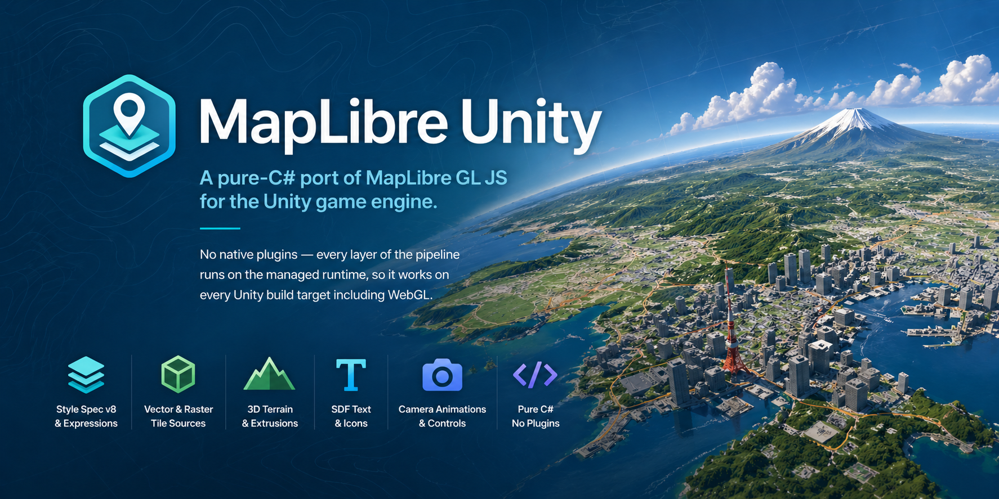

<p align="center">
  
</p>

# MapLibre Unity

[MapLibre](https://maplibre.org/), running natively as a Unity package.
Includes Unity-native components (`PrefabSource`, `MapCameraTarget`,
`CameraDrivenMapState`, …) so GameObjects can be anchored to a
`LngLat`, the map camera can be driven by external rigs like
Cinemachine, and the whole thing wires up through the Inspector.

**[▶ Live WebGL demo](https://kazukikuriyama.github.io/maplibre-unity/)**
— browse every bundled sample scene in the browser. Re-deployed
automatically on each tagged release.

## Features

- **Style spec v8** — parses upstream `style.json` files; full expression
  language (`interpolate-hcl` / `interpolate-lab`, `case`, `match`,
  `feature-state`, `image`, …) and filter syntax.
- **Sources** — raster, vector (PBF), GeoJSON, raster-DEM, image, PMTiles,
  MBTiles, plus pluggable `ICustomRasterSource` / `ICustomVectorSource`.
- **Layers** — fill, line (incl. dash + pattern), symbol (text + icon),
  raster, circle, fill-extrusion, heatmap, hillshade, sky, background,
  and user-supplied `ICustomLayer`.
- **Symbols** — TextMeshPro fallback plus an SDF glyph pipeline (point and
  line placement) that fetches glyph PBFs on demand and renders through a
  custom URP shader.
- **Camera** — pan / zoom / rotate / pitch, plus `easeTo` / `flyTo` /
  `fitBounds` / `zoomTo` matching MapLibre GL JS's API surface. Durations
  are in **milliseconds** (matches the upstream JS spec).
- **Runtime API** — `setStyle`, `addSource` / `addLayer`, `setPaintProperty`,
  `queryRenderedFeatures`, `addImage`, markers, popups, controls
  (Navigation / Scale / Geolocate / Fullscreen / Attribution).
- **Awaitable surface** — every long-running call has an `Async` sibling
  returning Unity 6 `Awaitable` (`LoadAsync`, `EaseToAsync`, `FlyToAsync`,
  `FitBoundsAsync`, `SetStyleAsync`, `LoadImageAsync`, `OnceAsync`, …).
  All accept a `CancellationToken`. Existing fire-and-forget methods are
  kept for non-await contexts.
- **3D** — DEM-driven terrain with normal-mapped hillshade, fill-extrusion
  for buildings, free-camera options for external rigs.
- **Unity-only sources** — `PrefabSource` anchors any GameObject —
  buildings, vehicles, particle systems — to a `LngLat` with click /
  hover / drag events, automatic culling, and the same world-scale
  conversion the tile renderers use.
- **Concurrency** — vector tile parsing and mesh building run on
  `Task.Run`; `feature-state` is `ConcurrentDictionary`-backed.
- **URP** — ships with URP shaders (Lit raster, dashed line, SDF text,
  fill-extrusion, hillshade, heatmap kernel, sky gradient).

## Feature Comparison

Comparison against MapLibre Native (C++) and MapLibre GL JS (Web).
(Legend: ✅ supported / ⚠️ basic support / ❌ not supported)

### Sources

| Source | MapLibre Native | MapLibre GL JS | MapLibre Unity |
|---|:---:|:---:|:---:|
| raster | ✅ | ✅ | ✅ |
| raster-dem | ✅ | ✅ | ✅ |
| vector | ✅ | ✅ | ✅ |
| geojson | ✅ | ✅ | ✅ |
| image | ✅ | ✅ | ✅ |
| video | — | ✅ | ❌ |

### Layer Types

| Layer | MapLibre Native | MapLibre GL JS | MapLibre Unity |
|---|:---:|:---:|:---:|
| background | ✅ | ✅ | ✅ |
| fill | ✅ | ✅ | ✅ |
| line | ✅ | ✅ | ✅ |
| symbol (text/icon) | ✅ | ✅ | ✅ |
| raster | ✅ | ✅ | ✅ |
| circle | ✅ | ✅ | ✅ |
| fill-extrusion | ✅ | ✅ | ✅ |
| heatmap | ✅ | ✅ | ✅ |
| hillshade | ✅ | ✅ | ✅ |
| sky | ✅ | ✅ | ✅ |
| custom layer (`ICustomLayer`) | ✅ | ✅ | ✅ |

### Camera / Controls

| Feature | MapLibre Native | MapLibre GL JS | MapLibre Unity |
|---|:---:|:---:|:---:|
| pan / zoom / rotate / pitch | ✅ | ✅ | ✅ |
| easeTo / flyTo / zoomTo | ✅ | ✅ | ✅ |
| fitBounds | ✅ | ✅ | ✅ |
| 3D terrain (DEM) | ✅ | ✅ | ✅ |
| Globe projection | ⚠️ | ✅ | ❌ |

### Runtime API / Events

| Feature | MapLibre Native | MapLibre GL JS | MapLibre Unity |
|---|:---:|:---:|:---:|
| on / off / once | ✅ | ✅ | ✅ |
| on (layer-filtered) with auto `e.features` | ✅ | ✅ | ✅ |
| styledata / sourcedata / dataloading / error | ✅ | ✅ | ✅ |
| resize / remove / wheel / drag* | ✅ | ✅ | ✅ |
| jumpTo / setCenter / setZoom / setBearing / setPitch | ✅ | ✅ | ✅ |
| getCenter / getZoom / getBearing / getPitch / getBounds | ✅ | ✅ | ✅ |
| addSource / removeSource | ✅ | ✅ | ✅ |
| addLayer / removeLayer / moveLayer | ✅ | ✅ | ✅ |
| addImage / removeImage / updateImage / hasImage / listImages | ✅ | ✅ | ✅ |
| setStyle (runtime) | ✅ | ✅ | ✅ |
| setPaintProperty / setLayoutProperty | ✅ | ✅ | ✅ |
| queryRenderedFeatures | ✅ | ✅ | ✅ |
| Markers / Popups | ✅ | ✅ | ✅ |
| Style expressions (incl. `case` / `match` / `interpolate-hcl` / `interpolate-lab`) | ✅ | ✅ | ✅ |
| `feature-state` (set/get/remove + paint/filter expressions) | ✅ | ✅ | ✅ |
| Filter expressions | ✅ | ✅ | ✅ |
| Custom raster / vector source (`ICustomRasterSource` / `ICustomVectorSource`) | ✅ | ✅ | ✅ |
| Glyph URL / SDF text rendering (point + line placement) | ✅ | ✅ | ✅ |
| RTL / complex text shaping | ✅ | ✅ | ❌ |

### Rendering / Concurrency

| Item | MapLibre Native | MapLibre GL JS | MapLibre Unity |
|---|:---:|:---:|:---:|
| GPU backend | OpenGL / Metal / Vulkan | WebGL 1/2 | Unity URP (incl. WebGL 2) |
| Vector tile processing | worker threads | Web Worker | `Task.Run` (background thread); coroutine + `ParseLazy` on WebGL Player |
| Tile cache | ✅ | ✅ | ✅ (LRU + disk cache; IndexedDB on WebGL) |
| Native plugins | — | — | pure C#, plus one ~250-line JSLib on WebGL only (IndexedDB bridge) |
| feature-state thread safety | ✅ | ✅ | ✅ (`ConcurrentDictionary`) |

## Requirements

- Unity 6 (6000.3.10f1) or later
- Universal Render Pipeline (URP) 17.x
- TextMeshPro — required for symbol layers (text / icons)
  - On first use, import resources via **Window > TextMeshPro > Import TMP Essential Resources**

### Supported platforms

**Verified:** Standalone — Windows / macOS / Linux. This is the only
platform the maintainer regularly builds and runs against.

**Untested:** iOS / Android. The runtime uses `Task.Run`, synchronous
`System.IO.File` for the tile / glyph cache, and `UnityWebRequest` for
networking — all of which are available on iOS and Android in
principle, so the library is *expected* to work there. No mobile
build has been smoke-tested by the maintainer; reports (and PRs) from
people trying it on device are very welcome.

**Experimental:** WebGL. Raster basemaps, vector tiles (Fill / Line /
Circle / FillExtrusion), Heatmap, and Symbol / SDF text all render on
WebGL Player builds verified by the maintainer. Tiles persist across
page reloads via an IndexedDB bridge. WebGL Player has no OS font
enumeration, so CJK / emoji labels need a `TMP_FontAsset` wired to
`MapLibreMap > Text > Symbol Font` — see
[Documentation~/Architecture.md](Documentation~/Architecture.md#webgl-implementation-notes)
for the full set of WebGL adaptations.

## Installation

### Via Unity Package Manager (git URL)

The exact UPM Git URL pinned to the latest tag is published with every
release. See the
[**latest release**](https://github.com/KazukiKuriyama/maplibre-unity/releases/latest)
page — the release notes contain copy-paste blocks for both Package
Manager dialog and `Packages/manifest.json` entry, so README never needs
to be edited per version.

The
[Releases index](https://github.com/KazukiKuriyama/maplibre-unity/releases)
also lists older tags if you need to pin to a specific historical
version.

### Clone the repository (contributors / sample browsing)

The repository itself is a Unity project. The package source lives at
`Packages/com.kazukikuriyama.maplibre-unity/` and is loaded as an embedded UPM
package when you open the project in Unity Hub. Sample scenes ship
bundled at `Packages/com.kazukikuriyama.maplibre-unity/Samples/` and
appear directly under **Packages → MapLibre Unity → Samples** in the
Project window — no import step is required. Open
`Packages/MapLibre Unity/Samples/Home/HomeScene.unity` to launch the
demo browser.

### Shader registration

The package's URP shaders are registered with **Project Settings →
Graphics → Always Included Shaders** automatically on first Editor
load — no manual setup required. To re-run the registration manually
(e.g. after pulling new shader files), use **MapLibreUnity → Register
Always Included Shaders**. Implementation details live in
[Documentation~/Architecture.md](Documentation~/Architecture.md#shader-registration).

## Quick Start

1. Open this project (or any project that has installed the package)
   with Unity Hub.
2. Open `Packages/MapLibre Unity/Samples/Home/HomeScene.unity` from
   the Project window — a launcher scene that lists every demo and
   loads the selected one at runtime. (Open
   `Packages/MapLibre Unity/Samples/BasicRasterMap/` directly if you
   want the minimal end-to-end example.)
3. Add every sample scene under
   `Packages/com.kazukikuriyama.maplibre-unity/Samples/` to
   **File → Build Profiles** so the launcher's `SceneManager.LoadScene`
   lookups resolve.
4. Press Play. The selected sample (OSM raster around Tokyo by
   default) appears.

A longer, step-by-step walkthrough — including how to drive the style
from C#, react to input events, and avoid the common stumbling blocks —
lives at [Documentation~/GettingStarted.md](Documentation~/GettingStarted.md).

### Controls

| Input | Action |
|------|------|
| Left drag | Pan |
| Scroll | Zoom |
| Right drag | Rotate |
| Middle drag | Pitch |

## Usage

1. Create an empty GameObject in a scene
2. Add the `MapLibreMap` component
3. In the Inspector, set **Style Json** with a style JSON string, or set **Style Url** with a style URL
4. Press Play

### Example `style.json`

```json
{
    "version": 8,
    "name": "My Map",
    "center": [139.7670, 35.6814],
    "zoom": 10,
    "sources": {
        "osm-raster": {
            "type": "raster",
            "tiles": [
                "https://a.tile.openstreetmap.org/{z}/{x}/{y}.png"
            ],
            "tileSize": 256,
            "maxzoom": 19
        }
    },
    "layers": [
        {
            "id": "background",
            "type": "background",
            "paint": { "background-color": "#e0e0e0" }
        },
        {
            "id": "osm-tiles",
            "type": "raster",
            "source": "osm-raster"
        }
    ]
}
```

## Text / Fonts

Symbol layer text labels use TextMeshPro (SDF).

### Automatic setup (recommended)

Open the **MapLibreUnity > Font Setup** menu to auto-generate a `TMP_FontAsset` from a font installed on the OS and assign it to `MapLibreMap` in the scene.

### Fallback behavior (development only)

If **Symbol Font** is not assigned, a font installed on the OS (Hiragino on macOS, Yu Gothic on Windows, etc.) is loaded at runtime for display.

This works the same way as Word or a web browser rendering text using OS fonts — no font files are copied or redistributed. It exists so developers can run samples without configuring a font first.

> **Note for distributing an application:**
>
> This fallback only works when the target OS has the required fonts installed.
> When shipping an app, explicitly configure a font using one of:
>
> 1. Generate and assign a font asset via **MapLibreUnity > Font Setup**
> 2. Include an OFL-licensed font (e.g. Noto Sans JP) in the project and assign it manually
>
> If you bundle a font file, make sure its license allows redistribution.
> See [THIRD_PARTY_NOTICES.md](Packages/com.kazukikuriyama.maplibre-unity/THIRD_PARTY_NOTICES.md) for a list of recommended fonts.

### Manual setup

To use your own font:

1. Import a `.ttf` / `.otf` file into the project
2. Generate a `TMP_FontAsset` via **Window > TextMeshPro > Font Asset Creator** (use Dynamic mode for CJK)
3. Assign the asset to `MapLibreMap > Text > Symbol Font` in the Inspector

See [THIRD_PARTY_NOTICES.md](Packages/com.kazukikuriyama.maplibre-unity/THIRD_PARTY_NOTICES.md) for recommended fonts and license details.

## Advanced Features

Detailed walkthroughs live under `Documentation~/`. Quick map:

- **[Extensibility](Documentation~/Extensibility.md)** — `ICustomLayer`
  injects user-rendered geometry into the map's render order;
  `ICustomRasterSource` / `ICustomVectorSource` serve tiles from any
  backend (procedural, local files, custom HTTP); `AddImage`
  registers a `Texture2D` as a sprite addressable from style
  expressions.
- **[Offline tile archives](Documentation~/OfflineArchives.md)** —
  pure-C# PMTiles reader (HTTPS Range or local file) and an
  MBTiles wrapper that takes a user-supplied `IMBTilesBackend` for
  SQLite.
- **[Feature state](Documentation~/Expressions.md#feature-state)** —
  drive paint and filter expressions from runtime state (hover,
  selection, animated values). Rebuilds only the affected layers and
  reuses cached tile bytes.
- **[Glyph URL / SDF text](Documentation~/StyleSpec.md#glyphs)** —
  declare `"glyphs"` in the style and labels render via a runtime SDF
  atlas without any `TMP_FontAsset` configuration.
- **Unity-only extensions** — Style Spec sources cover the
  cross-platform feature set; a small Unity-specific layer adds:
  `PrefabSource` (anchor any GameObject — buildings, vehicles, particle
  effects — to LngLat with click / hover / drag events),
  `MapCameraTarget` (Transform follows a coordinate, ready to plug into
  Cinemachine's `LookAt` / `TrackingTarget`), and `CameraDrivenMapState`
  (auto-syncs map state when an external rig drives the camera, so tiles
  load for the area being looked at). See `PrefabSourceDemo` and
  `ParticleSourceDemo` samples.

## Samples

Samples ship bundled with the package and appear in the Project window
under **Packages → MapLibre Unity → Samples** as soon as the package
is installed — no import step required. Open
`Packages/MapLibre Unity/Samples/Home/HomeScene.unity` for a launcher
that lists every demo, or load one directly. Samples are read-only
because they live under `Packages/`; copy a demo folder into `Assets/`
if you want to modify it. The
[full samples index](Packages/com.kazukikuriyama.maplibre-unity/Samples/README.md)
groups every demo by topic. Highlights:

| Sample | What it shows |
|---|---|
| `BasicRasterMap` | Minimal end-to-end raster setup. Start here. |
| `VectorDemo` / `VectorWithLabels` | Vector tile rendering with fill / line / symbol layers. |
| `GlyphUrlDemo` | SDF text via a `glyphs` URL — no TMP font asset needed. |
| `LineLabelsDemo` | Curved labels along roads using SDF line placement. |
| `FeatureStateHoverDemo` | Hover / select highlights via `SetFeatureState`. |
| `CustomLayerDemo` | `ICustomLayer` injecting 3D objects pinned to LngLat. |
| `CustomSourceDemo` | Procedural noise tiles via `ICustomRasterSource`. |
| `PrefabSourceDemo` | `PrefabSource` anchoring GameObjects (buildings, vehicles) to LngLat with click / hover / drag. |
| `ParticleSourceDemo` | `PrefabSource` driving Unity Particle Systems pinned to LngLat. |
| `FillExtrusionDemo` | Extruded buildings with per-feature heights. |
| `TerrainDemo` | DEM-driven terrain + hillshade lighting. |
| `HeatmapDemo` | Density heatmap with weight expressions. |
| `MarkerPopupDemo` | DOM-style markers / popups anchored to map coords. |
| `QueryFeaturesDemo` | `queryRenderedFeatures` under the cursor. |
| `EventDemo` / `PointerEventDemo` | Map / layer event subscriptions. |
| `StyleSwitchDemo` | Hot-swap `style.json` at runtime. |
| `FitBoundsDemo` | `fitBounds` camera helper. |
| `CameraAnimationDemo` | `EaseTo` / `FlyTo` / `ZoomTo` / `RotateTo` / `PanBy` / `JumpTo` side-by-side. |
| `SkyAndLightDemo` | `SetSky` / `SetLight` driven by a time-of-day slider. |
| `FreeCameraDemo` | Drive the map camera externally — orbit rig, Cinemachine-style. |
| `PMTilesDemo` | Stream a single-file PMTiles archive over HTTP Range. |
| `GeoJsonDemo` | Static GeoJSON source rendered as fill / line / circle layers. |
| `RuntimeGeoJsonDemo` | Add / remove GeoJSON sources at runtime. |
| `ColorInterpolationDemo` | `interpolate-hcl` vs `interpolate-rgb` side by side. |
| `PerFeaturePatternDemo` / `BackgroundPatternDemo` | `fill-pattern` and `background-pattern` driven by feature properties / sprite atlas. |
| `LineGradientDemo` | `line-gradient` paint with `["line-progress"]`. |
| `SymbolTranslateDemo` | `text-translate` / `icon-translate` offsets. |
| `ImageSourceDemo` / `SpriteIconTest` | Raster image overlay + sprite-atlas icons. |
| `DashLineTest` / `CircleDemo` / `CirclePitchDemo` / `HillshadeDemo` | Layer-type smoke samples. |
| `DynamicSourceLayerDemo` | `addSource` / `addLayer` / `moveLayer` end-to-end. |
| `PropertyDemo` | `setPaintProperty` / `setLayoutProperty` runtime edits. |
| `FontTest` | Font fallback + dynamic CJK glyph generation. |

## Documentation

End-user prose lives under `Documentation~/`. The `~` suffix tells Unity
to skip the folder during asset import, so the docs site never bloats
build pipelines.

Curated guides:

- [Getting Started](Documentation~/GettingStarted.md) — fresh-project
  walkthrough.
- [Style Spec coverage](Documentation~/StyleSpec.md) — supported
  sources, layers, and runtime style mutation.
- [Expressions](Documentation~/Expressions.md) — expression / filter
  syntax and the `feature-state` API.
- [Camera animation](Documentation~/CameraAnimation.md) — `easeTo`,
  `flyTo`, `fitBounds`, and awaitable variants.
- [Troubleshooting](Documentation~/Troubleshooting.md) — common
  rendering, tile, expression, and build-time problems.
- [Samples index](Packages/com.kazukikuriyama.maplibre-unity/Samples/README.md) — every demo
  scene grouped by topic.

Contributor docs:

- [CONTRIBUTING.md](CONTRIBUTING.md) — how to file issues, run tests,
  and submit PRs.
- [CODE_OF_CONDUCT.md](CODE_OF_CONDUCT.md) — community standards.
- [Architecture](Documentation~/Architecture.md) — pipeline overview,
  package layout, shader-registration mechanism, and WebGL
  implementation notes.
- [AGENTS.md](AGENTS.md) — canonical project rules for AI coding
  agents.


The API reference is generated from XML doc-comments via
[DocFX](https://dotnet.github.io/docfx/). To build the site locally:

```sh
# Install the DocFX CLI once (requires .NET 8 SDK or newer)
dotnet tool install -g docfx

# Open the project in Unity once so the Runtime / Editor source paths
# resolve, then build the documentation site
docfx Documentation~/docfx.json --serve
```

The generated site lands in `Documentation~/_site/` (gitignored) and
DocFX serves it at `http://localhost:8080`. The metadata extraction step
populates `Documentation~/api/` (also gitignored apart from a seed
`index.md`) with one YAML file per public type.

A GitHub Pages publish workflow is left as a future addition (paired
with whatever CI runner ends up being viable for this repo).

## License

MIT License — see [LICENSE](LICENSE) for details.

Copyright (c) 2026 Kazuki Kuriyama

Third-party attributions (mapbox/earcut, MapLibre GL JS, Newtonsoft.Json,
Unity packages, recommended fonts) are listed in
[THIRD_PARTY_NOTICES.md](Packages/com.kazukikuriyama.maplibre-unity/THIRD_PARTY_NOTICES.md).

## Trademark Notice

"MapLibre" is a trademark of the MapLibre community. This project uses
the name to indicate compatibility with the MapLibre Style Spec and the
MapLibre GL JS API surface; it is **not** an official MapLibre project
and is not endorsed by, affiliated with, or sponsored by the MapLibre
organization. Refer to the
[MapLibre trademark guidelines](https://github.com/maplibre/maplibre/blob/main/TRADEMARK_GUIDELINES.md)
when using the name in derivative works.

"Mapbox" is a registered trademark of Mapbox, Inc. References to
"Mapbox Vector Tile", "Mapbox glyph PBF", "Mapbox Terrain-RGB", and
similar terms in this project's source comments and documentation are
made nominatively, solely to identify the public specifications and
file formats this library implements. This project is **not**
affiliated with, endorsed by, or sponsored by Mapbox, Inc.
